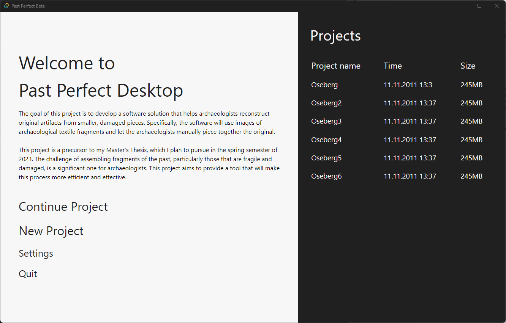
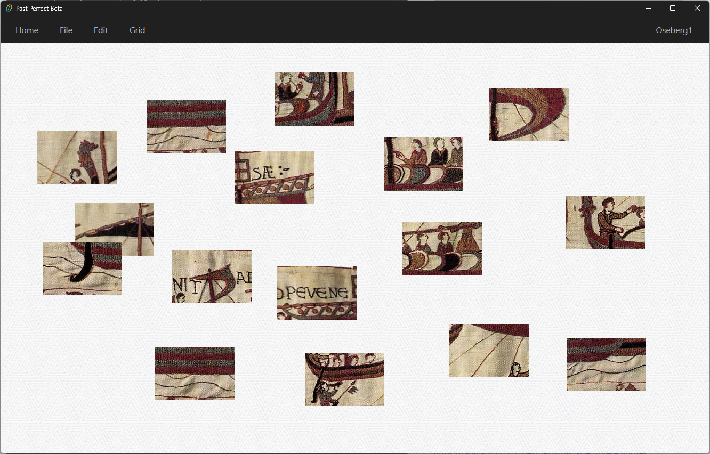
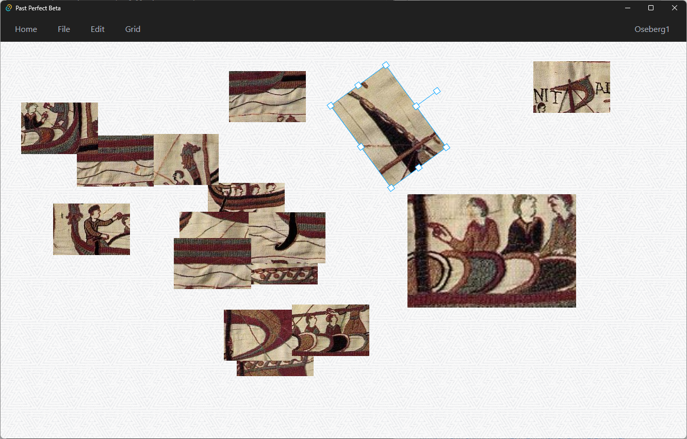
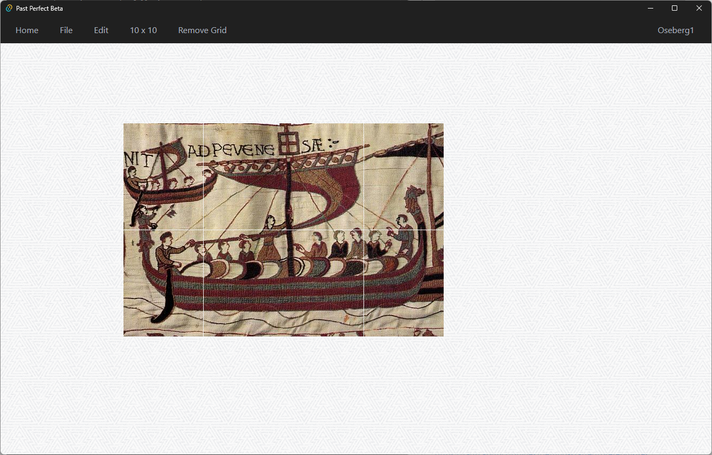

# Past Perfect Beta

This program is designed for archaeologists and restorers to digitally
reconstruct complete artifacts from fragments found at excavation
sites, without the need to physically handle the fragile pieces.

This software serves as part of my Master Thesis for the spring
semester of 2023 in the Applied Computer Science program at NTNU
Gjøvik, as well as a contribution to the IMT4894 Advanced Project Work
course.

## Author

- [@Casper F Gulbrandsen](https://github.com/casperfg)

## Screenshots









## Installation

Make sure you have Tauri installed and every[prerequisites](https://tauri.app/v1/guides/getting-started/prerequisites)

To run the project use the following commands:

```bash
  npm install #to install the required dependencies
  npm run tauri dev #to run the program in a Tauri instance
```
