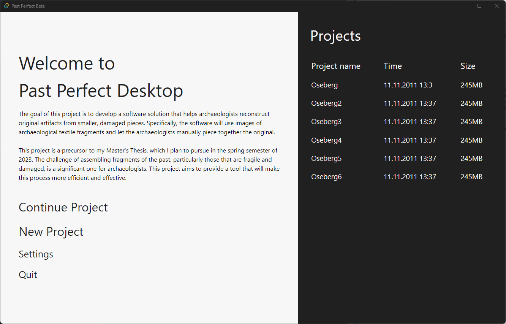
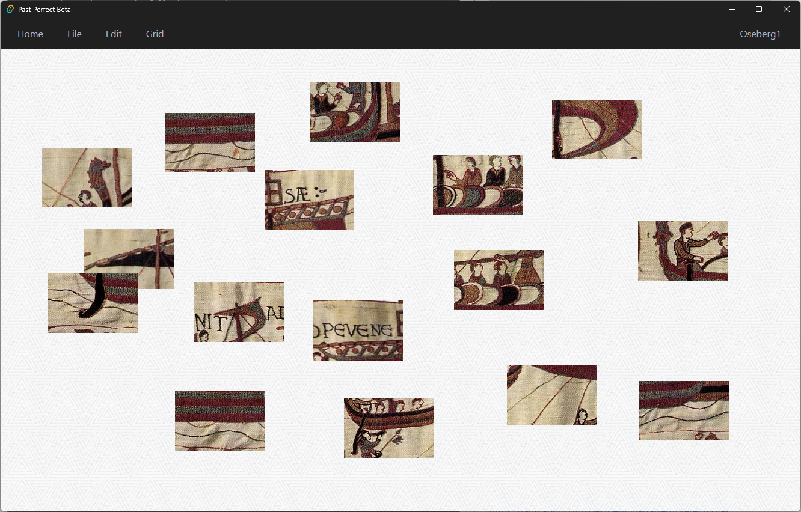
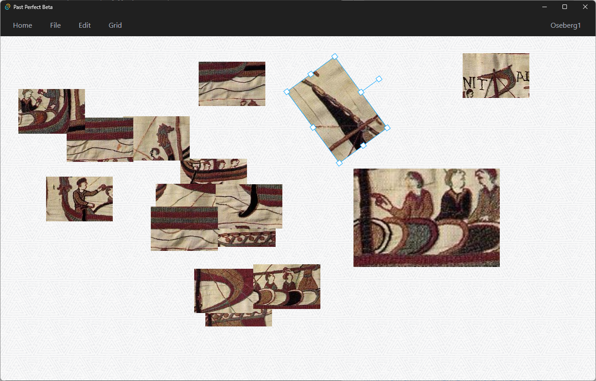
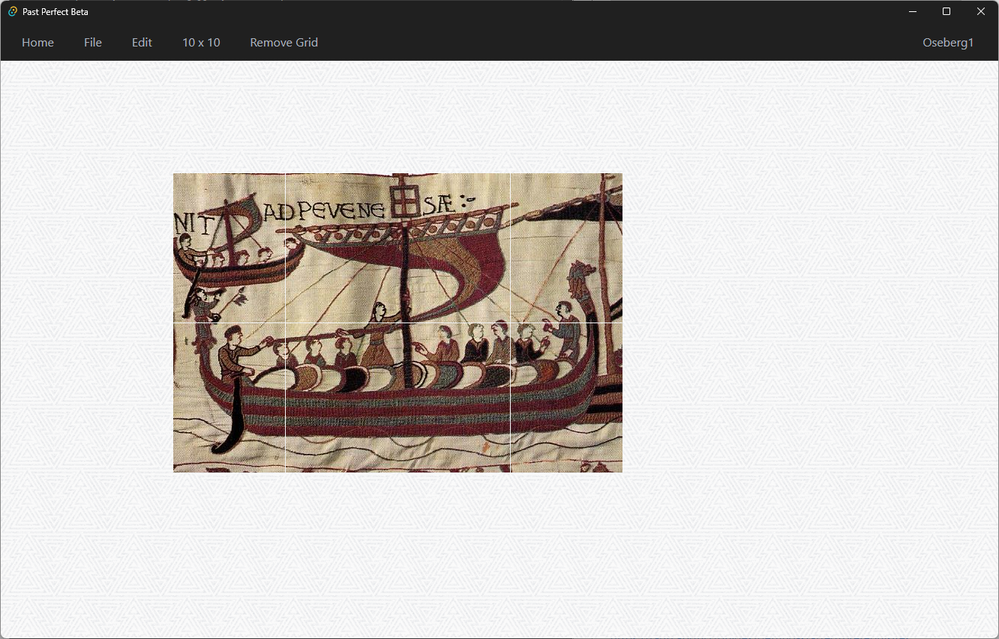

# Artifact Assembly

The goal of this project is to develop a software solution that helps users reconstruct original artefacts from smaller, damaged pieces. Specifically, the software will use images of archaeological textile fragments and let the archaeologists manually piece together the original object.

## Software History
This project started as a precursor to [@Casper's](https://github.com/casperfg) [Master's Thesis](https://ntnuopen.ntnu.no/ntnu-xmlui/handle/11250/3079162), which he planned to pursue in the spring semester of 2023. The challenge of assembling fragments of the past, particularly those that are fragile and damaged, is a significant one for archaeologists. This project aims to provide a tool that will make this process more efficient and effective.

The software was continued by [Oda](https://github.com/odastein), [Mikael](https://github.com/MikaelRoev) and [Mathias](https://github.com/Mathiaiv) as part of their bachelor's Thesis. 

## Authors

- [@Casper F Gulbrandsen](https://github.com/casperfg)
- [@Oda K F Steinsholt](https://github.com/odastein)
- [@Mikael Røv Mathiassen](https://github.com/MikaelRoev)
- [@Mathias Iversen](https://github.com/Mathiaiv)

## Screenshots









## Installation

Make sure you have Tauri installed and every [prerequisites](https://tauri.app/v1/guides/getting-started/prerequisites)

To run the project use the following commands:

```bash
  npm install #to install the required dependencies
  npm run tauri dev #to run the program in a Tauri instance
```
