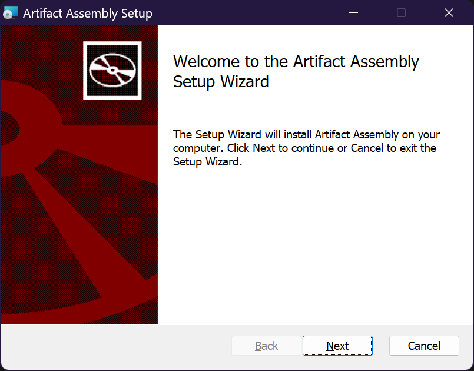

# Artifact Assembly

The goal of this project is to develop a software solution that helps users reconstruct original artefacts from smaller, damaged pieces. Specifically, the software will use images of archaeological textile fragments and let the archaeologists manually piece together the original object.

## Software History
This project started as a precursor to [Casper's](https://github.com/casperfg) [Master's Thesis](https://ntnuopen.ntnu.no/ntnu-xmlui/handle/11250/3079162), which he planned to pursue in the spring semester of 2023. The challenge of assembling fragments of the past, particularly those that are fragile and damaged, is a significant one for archaeologists. This project aims to provide a tool that will make this process more efficient and effective.

The software was continued by [Oda](https://github.com/odastein), [Mikael](https://github.com/MikaelRoev) and [Mathias](https://github.com/Mathiaiv) as part of their bachelor's Thesis. 

## Authors
- [@Casper F Gulbrandsen](https://github.com/casperfg)
- [@Oda K F Steinsholt](https://github.com/odastein)
- [@Mikael Røv Mathiassen](https://github.com/MikaelRoev)
- [@Mathias Iversen](https://github.com/Mathiaiv)

## Installation
### Latest Release
To install the latest version of the software, head to [this GitHub page](https://github.com/MikaelRoev/artifact_assembly/releases) and download either the .exe or .msi file from the latest release. 


When downloaded, run the installation wizard.



### Start development
To start development on the software, you need the source code, which can be downloaded from our this GitHub.

#### Tauri Prerequisites
The software is dependent on Tauri to make it a standalone runnable.
Tauri has some [prerequisites](https://tauri.app/v1/guides/getting-started/prerequisites/) to be able to run. For Windows, which we used, it will need the three things listed on the website.
1. Microsoft Visual Studio C++ Build Tools.
2. WebView2.
3. Rust.

After downloading and installing [build tools](https://visualstudio.microsoft.com/visual-cpp-build-tools/), it is important to select "Windows development with c++" and the latest version of the MSVC package and the latest version of the Sofware Development Kit (SDK) for either Windows 11 or 10 depending on what is on the computer.


Webview2 comes built-in with Windows 11 or can be downloaded for Windows 10 [here]( https://developer.microsoft.com/en-us/microsoft-edge/webview2?form=MA13LH).
The easiest way to install Rust is using the [rustup installer](https://www.rust-lang.org/tools/install) and following the instructions, or it is also possible to do it through the command line.

```bash
  winget install --id Rustlang.Rustup
```

When Rust is installed, it is important to make sure the correct toolchain is selected by running this in the command line.

```bash
  rustup default stable-msvc
```

With this, Rust and Tauri are set up correctly.

The last prerequisite is the Node Package Manager (NPM) tool, which comes with the [NodeJS installer](https://nodejs.org/en). When the installer has been downloaded and run, the installation can be confirmed in the command line by running.

```bash
  node -v
  npm -v
```

#### Testing and Building
Before running tests or building installation files, the node packages necessary for the software to run need to be installed using the command line located inside the root file of the project. This will create and fill the node_modules folder with the packages.

```bash
  npm install
```

Then, to run a local test development version of the software, run this command:

```bash
  npm run tauri dev
```

To create installation files, run this command:

```bash
  npm run tauri build.
```

The installation files can be found inside the src-tauri folder.

```bash
.1 /src-tauri/.
.2 target/.
.3 release/.
.4 bundle/.
.5 msi/.
.6 install\_file.msi.
.5 nsis/.
.6 install\_file.exe.
```

#### Starting and Running
The development test will start after the command is run, and will run as long as the command is not stopped or the software is exited. Then, the command will need to be ran again to start the development test. 
After the software is installed, it can be found by searching for it in the menu, and will only stop when the software is exited.

